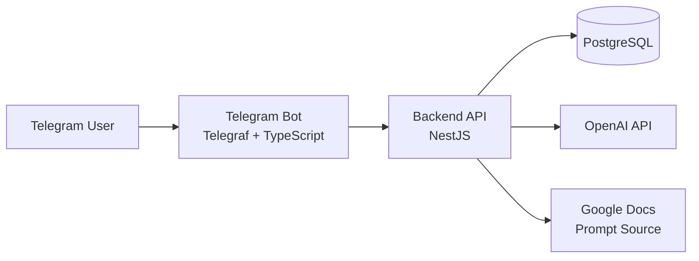

# Zerkalo

Zerkalo is the implementation repository for a diploma project focused on building a multilingual Telegram assistant for guided dialogue, self-reflection, and emotionally safe conversational support. The system combines a Telegram bot, a backend API, a PostgreSQL database, and an LLM integration into one deployable product.

The project is designed as a practical software engineering thesis: it demonstrates how to translate a human-centered idea into a production-like distributed application with clear architecture, validation rules, persistent storage, localization, and containerized deployment.

## Diploma Project Summary

The core idea of the diploma work is to create a conversational system that helps a user interact with an AI assistant through a familiar messaging interface. Telegram is used as the entry point because it provides a low-friction UX, while the backend handles user lifecycle, message persistence, prompt management, and integration with the language model.

The diploma combines several engineering concerns in one system:

- conversational UX in a messenger;
- multilingual interaction in English, Russian, and Polish;
- explicit disclaimer acceptance before the start of interaction;
- persistent storage of users and message history;
- configurable LLM behavior through an externally managed prompt;
- separation of presentation, business logic, and infrastructure layers;
- reproducible development and production deployment with Docker Compose.

## Goal and Objectives

The goal of the project is to implement a reliable assistant-oriented platform that supports guided conversations in Telegram and can serve as the practical part of a diploma thesis.

Main objectives:

1. Design a client-server architecture for a Telegram-based AI assistant.
2. Implement a backend API for user management, chat lifecycle, and message persistence.
3. Integrate a large language model for generating assistant responses.
4. Support multilingual onboarding and static content localization.
5. Add a disclaimer flow and store the user acceptance state on the server.
6. Provide a configurable prompt source that can be updated without code changes.
7. Containerize the solution for local development and production deployment.

## System Overview

The diploma project is split into several top-level technical components, which can be maintained as separate repositories:

- `bot/` contains the Telegram client application built with Telegraf.
- `api/` contains the NestJS backend that exposes the business logic and integrates with OpenAI, Google Docs, and PostgreSQL.
- `infra/` and `db/` contain environment and deployment configuration.

At runtime, the system works as follows:

1. A user sends a command or message to the Telegram bot.
2. The bot processes onboarding events such as `/start`, language selection, disclaimer acceptance, reset, and plain text messages.
3. The bot sends structured HTTP requests to the backend API.
4. The API validates input, loads or creates the user, reads the current system prompt, retrieves conversation context, and requests a response from OpenAI.
5. The API stores user and assistant messages in PostgreSQL through Prisma ORM.
6. The generated answer is returned to the bot and delivered back to the Telegram user.

## Architecture



### Bot Layer

The bot is responsible for user interaction and lightweight orchestration. It registers handlers for:

- `/start`;
- `/reset`;
- language selection;
- disclaimer acceptance;
- free-text user messages.

The bot also loads localization resources from `bot/locales/` and sends static messages in the selected language.

### API Layer

The backend is implemented with NestJS and follows a modular structure. It contains dedicated modules for:

- OpenAI integration;
- Google Docs integration;
- prompt retrieval and caching;
- Prisma access;
- chat, message, and user resources.

The API uses global request validation via `ValidationPipe` and publishes Swagger documentation at `/docs`.

### Data Layer

PostgreSQL is used as the primary persistent storage. Prisma provides schema management, migrations, and type-safe database access.

Current domain model:

- `User`: Telegram ID, selected language, disclaimer acceptance flag, creation time.
- `Message`: message content, role (`system`, `user`, `assistant`), creation time, relation to a Telegram user.

This model is sufficient for reconstructing conversation history and supporting future analytical or personalization features.

## Key Functional Features

### 1. Guided onboarding flow

Before chatting with the assistant, a user goes through an explicit onboarding sequence:

1. start the session;
2. choose a language;
3. read the disclaimer;
4. accept the disclaimer;
5. proceed to normal dialogue.

This is important both from a UX perspective and from a research/ethics perspective for a diploma project related to well-being support.

### 2. Multilingual interaction

The project supports three languages:

- English;
- Russian;
- Polish.

Static interface texts are stored in localization files, while the selected language is persisted in the database as part of the user profile.

### 3. Persistent conversation history

Messages are stored in PostgreSQL and linked to a Telegram user. This allows the system to preserve dialogue context and makes the assistant behavior more coherent across multiple messages.

### 4. Configurable assistant behavior

The assistant prompt is not hardcoded only in source files. The API retrieves the active prompt text from a public Google Docs document and keeps it in a one-hour in-memory cache. If the document is unavailable, the system falls back to a built-in constant.

This design is useful for experiments, iterative prompt tuning, and thesis demonstrations because assistant behavior can be adjusted without redeploying the application.

### 5. LLM integration

The backend integrates with the OpenAI API for response generation. The model name is configurable, and chat completion parameters such as temperature and token limit are defined on the server side.

## Technology Stack

### Backend

- Node.js
- TypeScript
- NestJS
- Prisma ORM
- PostgreSQL
- OpenAI SDK
- Google APIs / HTTP integration
- Swagger

### Bot

- Node.js
- TypeScript
- Telegraf
- i18next

### DevOps and Infrastructure

- Docker
- PostgreSQL 16

## Project Structure

```text
.
|-- api/      # NestJS backend, Prisma schema, migrations
|-- bot/      # Telegram bot, handlers, localization files
|-- db/       # Database environment files
|-- infra/    # Docker Compose definitions for dev and prod
```

More specifically:

- `api/src/modules/` contains infrastructure and integration modules.
- `api/src/resources/` contains domain resources such as chat, user, and message.
- `api/prisma/` contains the Prisma schema and migration history.
- `bot/src/bot-handlers/` contains Telegram interaction handlers.
- `bot/locales/` contains localized text resources.

## Development Setup

### Option 1. Run with Docker Compose

This is the recommended way to launch the full stack in development.

1. Create environment files from the corresponding examples:

- `db/.env`
- `api/.env`
- `bot/.env`

2. Start the stack:

```bash
cd infra
docker compose -f compose.yml up --build
```

3. Verify that services are available:

- API: `http://localhost:3000`
- Swagger: `http://localhost:3000/docs`
- PostgreSQL: `localhost:5432`

The development Compose configuration supports a live-edit workflow for both the API and the bot.

### Option 2. Run locally without Docker

Requirements:

- Node.js LTS;
- npm;
- PostgreSQL.

#### Backend

```bash
cd api
npm install
npx prisma migrate dev
npx prisma generate
npm run start:dev
```

#### Bot

```bash
cd bot
npm install
npm run dev
```

When running locally, make sure the bot points to the correct API base URL and the API points to the correct PostgreSQL host.

## Production Deployment

The repository includes a separate production Docker Compose configuration.

1. Prepare production environment files:

- `db/.env.prod`
- `api/.env.prod`
- `bot/.env.prod`

2. Start the production stack:

```bash
cd infra
docker compose -f compose.prod.yml up --build -d
```

3. Apply database migrations:

```bash
cd infra
docker compose -f compose.prod.yml up -d db
docker compose -f compose.prod.yml run --rm --build api npx prisma migrate deploy
```

In the production setup, the API is intended to be used internally by the bot inside the Docker network.

## Environment Configuration

Important backend variables include:

- `DATABASE_URL`
- `OPENAI_API_KEY`
- `BOT_PROMPT_DOCUMENT_ID`

Important bot variables include:

- `BOT_TOKEN`
- `API_URL`

The exact `.env` templates are stored inside each service directory.

## User Scenario

From the end-user perspective, the typical interaction flow is:

1. The user starts the bot.
2. The bot creates or restores the server-side user session.
3. The user selects a preferred language.
4. The bot displays a disclaimer in that language.
5. After acceptance, the user can send free-text messages.
6. The backend stores the dialogue and returns model-generated answers.
7. The user may reset the conversation state when needed.

## Academic Value of the Project

As a diploma work, this project demonstrates:

- practical application of modern backend and bot-development frameworks;
- integration of LLM-based functionality into a real product scenario;
- design of a multilingual user experience;
- use of persistent storage for conversational systems;
- application of validation, API documentation, and modular architecture;
- containerized deployment and environment separation for software delivery.

In other words, the repository is not only a working product prototype, but also a concrete technical artifact that can support a thesis chapter on architecture, implementation, deployment, and evaluation.

## Limitations and Future Work

The current implementation is a solid diploma prototype, but it can be extended further:

- automated test coverage can be expanded;
- moderation and safety controls can be strengthened;
- analytics and admin tooling can be added;
- richer conversation memory strategies can be introduced;
- observability and monitoring can be improved for production use.

## Additional Documentation

Service-specific notes are available in:

- `api/README.md`
- `bot/README.md`
- `db/README.md`
